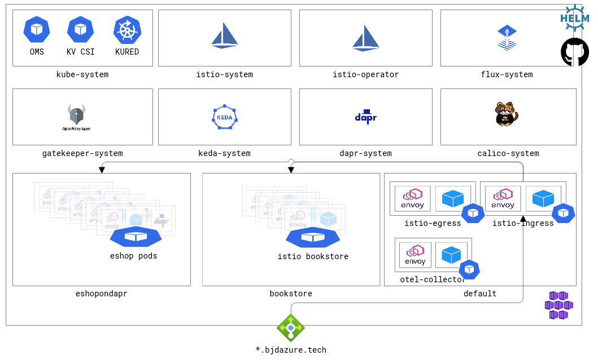

# Introduction 
This repository is covers how to stand up a secure, private AKS/Kubernetes cluster. This is not intended to be an AKS 101 or cover all possible secure AKS designs (for example using [HTTP Proxy](https://docs.microsoft.com/en-us/azure/aks/http-prox) instead of Azure Firewall). Azure has plenty of awesome [documentation](https://docs.microsoft.com/en-us/azure/architecture/reference-architectures/containers/aks-pci/aks-pci-ra-code-assets) and [guides](https://github.com/mspnp/aks-baseline-regulated) that go into depth on the overall design and best practices. 

This code is an opiniated method of applying the standards into an end to end solution using Terraform, GitHub Actions, Flux and Istio. 

## Detail Deployment Guide
Follow this [guide](./Deployment.md) to stand up a cluster in your environment

# Resources Created
Every kuberernetes cluster has several moving parts - even those deployed in a managed cloud environment. More so, if the cluster is to be private with egress filtering. Several resources in Azure must in place for the code to work properly. Typically these resources are stood-up by an Enterprise Platform Team following Azure's Cloud Adoption Framework so for more secure AKS builds, these are out of scope.  There is an example [Azure Firewall and RouteTable ARM Template](./infrastructure/prereqs/azuredeploy.template.json) that can elp with some of the prereqs. 

## Infrastructure
| |  |
--------------- | --------------- 
| Log Analytics Workspace | Application Insights |
| KeyVault (Private endpoint) | TLS Certificate:  *.bjdazure.tech |
| | KeyVault Secret: OpenTelemetry/Zipkin Configuration |
| Managed User identities | AKS Cluster Identity | 
| | AKS Kubelet Identity | 
| | Istio Pod Identity |
| Private AKS cluster | Add-Ons: OMS Policy Agent, KeyVault CSI Driver, Azure Pod Identity v1, FluxCDv2 ||
| Azure Internal Load Balancer 

### Diagram

---

## Kubernetes Resources 
| Flux | Istio |
--------------- | --------------- 
| Istio Operator | Ingress Gateway with TLS |
| Istio Service Mesh | Egress Gateway |
| Open Telemetry Collector | Distributive Tracing forwarded to Zipkin/Otel Collector |
| Kured Reboot Daemon | Catch-all Virtual Service ||
| Dapr Distributive Runtime ||
| Keda Autoscaler ||
| Azure Monitor configuration update for Prometheus ||
| [Istio Bookinfo](https://istio.io/latest/docs/examples/bookinfo/)||
| [eShopOnDapr](https://github.com/briandenicola/eShopOnDapr)||

### Diagram

